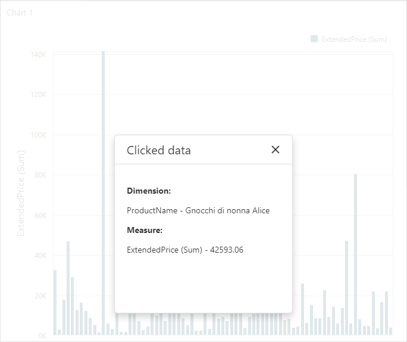

<!-- default badges list -->

<!-- default badges end -->

# Dashboard for Web Forms - How to Get Data from a Clicked Dashboard Item

This example shows how use the client-side [ASPxClientDashboard.ItemClick](https://docs.devexpress.com/Dashboard/js-DevExpress.Dashboard.Web.WebForms.ASPxClientDashboard?p=netframework#js_aspxclientdashboard_itemclick) event to get data from a clicked dashboard item.

<!-- default file list -->
## Files to Look at
* [Default.aspx](./CS/WebApp/Default.aspx) (VB:[Default.aspx](./VB/WebApp/Default.aspx))
* [Default.aspx.cs](./CS/WebApp/Default.aspx.cs) (VB:[Default.aspx.vb](./VB/WebApp/Default.aspx.vb))
<!-- default file list end -->

## Example Overview

The `ItemClick` event handler receives arguments of the [ASPxClientDashboardItemClickEventArgs](https://docs.devexpress.com/Dashboard/js-DevExpress.Dashboard.Web.WebForms.ASPxClientDashboardItemClickEventArgs) type that allows you to get data displayed in a clicked item: grid rows, series points, cards. Note that some dashboard items display multidimensional data. See the [Obtaining Underlying and Displayed Data](https://docs.devexpress.com/Dashboard/18078/create-the-designer-and-viewer-applications/web-dashboard/aspnet-web-forms-dashboard-control/obtain-underlying-and-displayed-data) help topic for more information about the general data structure.

Follow the steps below to get data from a clicked dashboard item:

1. Call the [GetData](https://docs.devexpress.com/Dashboard/js-DevExpress.Dashboard.Web.WebForms.ASPxClientDashboardItemClickEventArgs#js_aspxclientdashboarditemclickeventargs_getdata) method to request the [ASPxClientDashboardItemData](https://docs.devexpress.com/Dashboard/js-DevExpress.Dashboard.Web.WebForms.ASPxClientDashboardItemData?p=netframework) object that contains information about the item data.
2. Call the [GetAxisNames](https://docs.devexpress.com/Dashboard/js-DevExpress.Dashboard.Web.WebForms.ASPxClientDashboardItemData#js_aspxclientdashboarditemdata_getaxisnames) method to get a list of displayed axes.
3. Use the [GetDimensions](https://docs.devexpress.com/Dashboard/js-DevExpress.Dashboard.Web.WebForms.ASPxClientDashboardItemClickEventArgs#js_aspxclientdashboarditemclickeventargs_getdimensions_axisname_) and [GetAxisPoint](https://docs.devexpress.com/Dashboard/js-DevExpress.Dashboard.Web.WebForms.ASPxClientDashboardItemClickEventArgs#js_aspxclientdashboarditemclickeventargs_getaxispoint_axisname_) methods to get information about dimensions that correspond to each axis.
4. Use the [GetSlice](https://docs.devexpress.com/Dashboard/js-DevExpress.Dashboard.Web.WebForms.ASPxClientDashboardItemData#js_aspxclientdashboarditemdata_getslice_tuple_) method to get a data [slice](https://docs.devexpress.com/Dashboard/403003/web-dashboard/dashboard-control-for-javascript-applications-jquery-knockout-etc/obtain-underlying-and-displayed-data#slice) that corresponds to the target item's element and call the [GetMeasureValue](https://docs.devexpress.com/Dashboard/js-DevExpress.Dashboard.Web.WebForms.ASPxClientDashboardItemData?p=netframework#js_aspxclientdashboarditemdata_getmeasurevalue_measureid_) method to get the last level's measure values in the slice.

## Documentation

- [Client Side API Overview for ASP.NET Web Forms Dashboard](https://docs.devexpress.com/Dashboard/116302/web-dashboard/aspnet-web-forms-dashboard-control/client-side-api-overview?p=netframework)
- [Obtain Underlying and Displayed Data in ASP.NET Web Forms Dashboard Control](https://docs.devexpress.com/Dashboard/18078/web-dashboard/aspnet-web-forms-dashboard-control/obtain-underlying-and-displayed-data)

## More Examples

- [Dashboard for ASP.NET Core - How to obtain a dashboard item's client data](https://github.com/DevExpress-Examples/asp-net-core-dashboard-get-client-data)
- [Dashboard for ASP.NET Core - How to obtain a dashboard item's underlying data for a clicked visual element](https://github.com/DevExpress-Examples/asp-net-core-dashboard-get-underlying-data-for-clicked-item)
- [Dashboard for ASP.NET Core - How to obtain underlying data for the specified dashboard item](https://github.com/DevExpress-Examples/asp-net-core-dashboard-display-item-underlying-data)
- [Dashboard for Web Forms - How to obtain a dashboard item's client data](https://github.com/DevExpress-Examples/how-to-obtain-a-dashboard-items-client-data-in-the-aspnet-dashboard-control-t492284)
- [Dashboard for Web Forms - How to obtain a dashboard item's underlying data for a clicked visual element](https://github.com/DevExpress-Examples/aspxdashboard-how-to-obtain-a-dashboard-items-underlying-data-for-a-clicked-visual-element-t492257)
- [Dashboard for Web Forms - How to obtain underlying data for the specified dashboard item](https://github.com/DevExpress-Examples/aspxdashboard-how-to-obtain-underlying-data-for-the-specified-dashboard-item-t518504)
